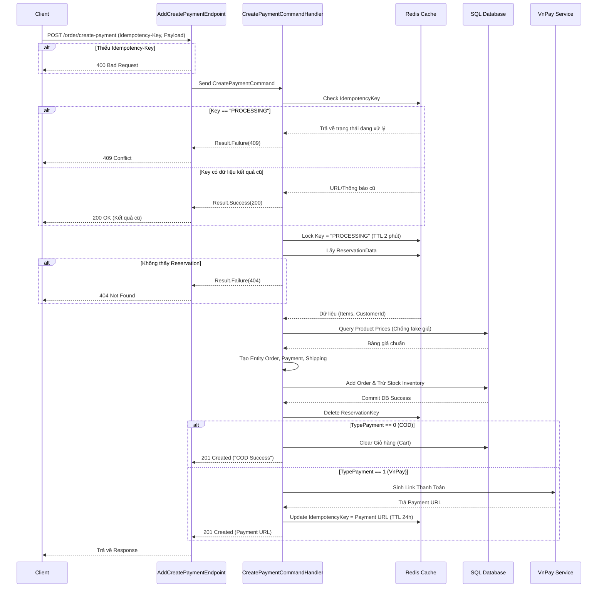

# Tài liệu API: Khởi tạo thanh toán & Tạo đơn hàng (Create Payment)

## 1. Thông tin chung (Overview)
- **Tên nghiệp vụ:** Khởi tạo giao dịch thanh toán và tạo đơn hàng chính thức từ Reservation.
- **HTTP Method:** `POST`
- **Route/URL:** `/order/create-payment`
- **Mô tả ngắn gọn:** API này được gọi sau khi khách hàng đã lock hàng (giữ chỗ - Reservation). Nó tiếp nhận thông tin giao hàng, phương thức thanh toán, tính toán lại tổng tiền từ Database (đề phòng client giả mạo giá), tạo đơn hàng, trừ kho vật lý và sinh ra link thanh toán (VnPay) hoặc xác nhận đơn hàng COD. Hỗ trợ Idempotency để chống duplicate giao dịch.

---

## 2. Hợp đồng dữ liệu (API Contract)

### 2.1. Authentication/Authorization
- **Bảo mật:** Yêu cầu đăng nhập hợp lệ (JWT Bearer Token).
- **Rate Limiting:** Bị giới hạn gọi liên tục bởi policy `create_payment`.

### 2.2. Request
**Headers:**
| Tên Header | Bắt buộc | Kiểu | Mô tả |
| :--- | :---: | :--- | :--- |
| `Idempotency-Key` | Yes | `string` | Khóa duy nhất (VD: UUID) sinh từ Client để chống gọi trùng lặp (Double-charge). |
| `Authorization` | Yes | `string` | `Bearer <JWT_Token>` |

**Body Payload (`ReqOrderInfo`):**
| Trường dữ liệu | Kiểu | Bắt buộc | Mô tả |
| :--- | :--- | :---: | :--- |
| `reservationId` | `string` | Yes | Mã giữ chỗ đơn hàng đã lưu trong Redis ở bước trước. |
| `amount` | `double` | Yes | Tổng tiền client dự kiến (Backend sẽ tự tính lại để đảm bảo chính xác). |
| `orderDescription` | `string` | Yes | Ghi chú đơn hàng. |
| `fullName` | `string` | Yes | Tên người nhận. |
| `address` | `string` | Yes | Địa chỉ giao hàng. |
| `phoneNumber` | `string` | Yes | Số điện thoại người nhận. |
| `typePayment` | `int` | Yes | `1`: Thanh toán online (VnPay), `0`: Thanh toán khi nhận hàng (COD). |

### 2.3. Responses
| Status Code | Điều kiện xảy ra | Payload trả về (Mẫu) |
| :--- | :--- | :--- |
| **201 Created** | Giao dịch thành công (Lần đầu). | Đối với COD: `"Payment created successfully with COD method."` Đối với VnPay: Trả về **URL thanh toán** (VD: `https://sandbox.vnpayment.vn/...`). |
| **200 OK** | Trùng `Idempotency-Key` (Request cũ đã hoàn thành). | Trả lại kết quả của Request đã thành công trước đó (VD: URL VnPay cũ). |
| **400 Bad Request** | Thiếu `Idempotency-Key` hoặc Dữ liệu Reservation rỗng/bị lỗi. | `{"message": "Missing Header: Idempotency-Key is required.", "errorCode": "ERR_MISSING_IDEMPOTENCY_KEY"}` |
| **404 Not Found** | Không tìm thấy `reservationId` trong Redis. | `{"message": "No reservation found for this order."}` |
| **409 Conflict** | Giao dịch với `Idempotency-Key` này đang trong quá trình xử lý (tránh race condition). | `{"message": "Giao dịch đang được xử lý."}` |
| **500 Internal Error**| Lỗi hệ thống, lỗi DB hoặc lỗi gọi dịch vụ ngoại vi. | `{"message": "An internal error occurred while processing the payment."}` |

---

## 3. Luồng xử lý chi tiết (Internal Flow & Side Effects)

**Bước 1: Validate tại Endpoint**
- Endpoint kiểm tra header `Idempotency-Key`. Nếu thiếu, reject ngay lập tức (Status 400).
- Trích xuất địa chỉ IP của Client từ Request (`HttpContext.Connection.RemoteIpAddress`).

**Bước 2: Xử lý Idempotency (Chống trùng lặp) tại Handler**
- Hệ thống Redis kiểm tra key `Idempotency:Payment:{idempotencyKey}`.
- Nếu key tồn tại và đang ở trạng thái `PROCESSING`: Báo lỗi 409 (Conflict).
- Nếu key đã có kết quả trả về trước đó: Trả ngay kết quả cũ với Status 200 (Bỏ qua toàn bộ luồng tạo đơn).
- Nếu chưa có: Set lock Redis `PROCESSING` với TTL 2 phút để giữ chỗ xử lý.

**Bước 3: Lấy dữ liệu Giữ chỗ (Reservation)**
- Truy xuất thông tin giỏ hàng tạm thời từ Redis bằng `Order:Reservation:{ReservationId}`.
- Parse ra danh sách sản phẩm (Mã màu, số lượng) và `CustomerId`. Nếu không có, reject 404.

**Bước 4: Tính toán giá và tạo đơn hàng (Chống gian lận)**
- Dựa vào danh sách `colorId` ở trên, hệ thống query Database (`ProductRepository`) để lấy giá trị `UnitPriceAtPurchase` thực tế đang lưu trong DB, tránh việc user sửa giá dưới Client.
- Khởi tạo thực thể `Order` với trạng thái `"Pending"`, cùng `OrderShippingDetail` và `Payment` (Trạng thái payment: `"Pending"`, Provider: `"COD"` hoặc `"VnPay"`).

**Bước 5: Thao tác Database & Side Effects**
- Lưu đơn hàng mới vào DB (`OrderRepository.AddAsync`).
- **Side Effect 1 (Kho hàng):** Cập nhật kho vật lý (`InventoryRepository`), thực hiện giảm số lượng Stock tương ứng.
- Commit Transaction (Lưu DB).

**Bước 6: Dọn dẹp & Tích hợp**
- Xóa `ReservationKey` khỏi Redis.
- **Nếu là COD (Type = 0):** Xóa các sản phẩm đã mua khỏi Giỏ hàng (`CartRepository.DeleteCartItemsAsync`), trả lời 201.
- **Nếu là VnPay (Type = 1):** Gọi Interface `IVnPayService` để sinh link thanh toán. Lưu URL này đè vào `IdempotencyKey` trên Redis với TTL 24 tiếng. Trả link VnPay về cho Client.

**Exception Handling:**
- Bất kì lỗi văng ra nào trong quá trình xử lý sẽ tự động gỡ lock (Xóa `IdempotencyKey`) và trả về 500 lỗi ẩn danh.

---

## 4. Sơ đồ tuần tự (Sequence Diagram)

